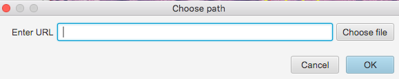
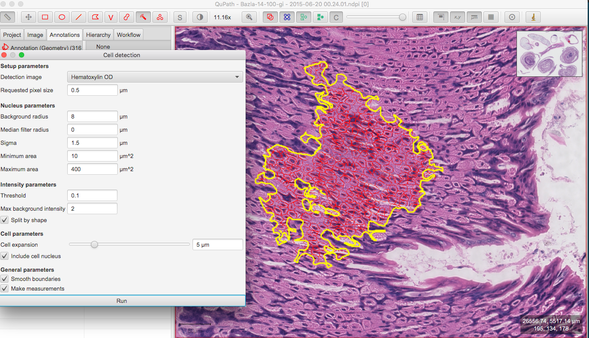
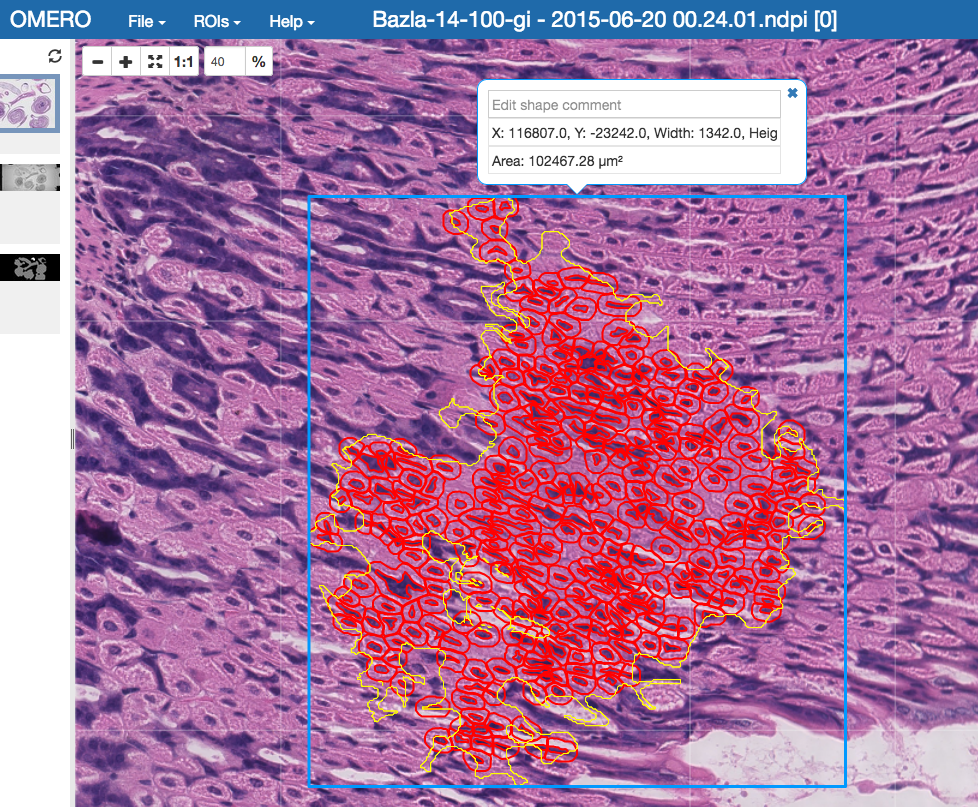

Analyze OMERO data using QuPath
===============================

Description
-----------

QuPath is a cross-platform software application designed for bioimage analysis - and specifically to meet the needs of whole slide image analysis and digital pathology.
See \ https://github.com/qupath/qupath/wiki/

We will show:

- How to open an image from OMERO server in QuPath and load the ROIs from OMERO on that image

- How to draw annotations and perform simple Cell detection in QuPath

- How to export the ROIs from QuPath as OME-XML

- How to import the OME-XML to the OMERO.server and attach the QuPath ROIs to the original image in OMERO

Resources
---------

- Data: example images from

  - IDR project referenced as `idr0018 <https://idr.openmicroscopy.org/webclient/?show=project-101>`_. Note that the data also have been imported into an OMERO.server where the possibility to write annotations exists (not the IDR server itself). See the ``Step-by-step`` section for further details.

-  Plugin ``ome-omero-roitool`` **v0.2.1** for import and export of ROIs to or from OMERO using OME-XML format. The ``ome-omero-roitool-xxx.zip`` under Releases also contains the scripts for export and import of ROIs from/to QuPath in OME-XML format. For precise installation steps, see below the ``Step-by-step`` section.

   - https://github.com/glencoesoftware/ome-omero-roitool

Setup
-----

Download QuPath v0.2.0 from https://qupath.github.io/.

Step-by-step
------------

#. You can go through this workflow directly with the `image <https://idr.openmicroscopy.org/webclient/?show=image-1920105>`_ in the IDR. QuPath will open that image without problems and no credentials are needed. Nevertheless, as you cannot write any data directly into IDR during your analysis, you will not be able to successfully import the resulting ROIs back into the OMERO in IDR. Thus, you might consider using another OMERO.server which you can write data to and upload this or another RGB large image into it.

#. In OMERO.web, identify an image in the `idr0018 <https://idr.openmicroscopy.org/webclient/?show=project-101>`_ project and the dataset `Baz1a-14-100-gastrointestinal <https://idr.openmicroscopy.org/webclient/?show=dataset-373>`_ contained in that project.

#. Select the first image and double-click on it. This will open the image in OMERO.iviewer, in a new tab of your browser.

#. If on a read-write OMERO server (i.e. not IDR), you can draw and save some ROIs on that image in OMERO.iviewer to be able to open them in QuPath later below, see `OMERO.iviewer guide <https://omero-guides.readthedocs.io/en/latest/iviewer/docs/iviewer_rois.html>`_ for how to do it.

#. In the OMERO.iviewer tab, select the whole URL in the address bar of your browser and copy it, for example using right-click and ``Copy``.

#. In QuPath, create a new Project ``File > Project > Create Project`` or open an existing one ``File > Project > Open Project``.

#. Once the Project is open, click the ``Add Images`` button above the left-hand pane in QuPath.

#. In the following dialog, check the ``Import objects`` checkbox. This tells QuPath to import all ROIs on that image from OMERO into QuPath. Note though that masks will not be imported.

#. In the same dialog, click the ``Input URL`` button.

#. Paste the link to the image you copied from the OMERO.iviewer tab (see above) into the dialog.

   |image0|

#. Click ``OK``.

#. If you are using a link not from IDR, but from a different OMERO.server protected by credentials, in the following dialog, enter your credentials.

   |image1|

#. The image thumbnail will appear in the left-hand pane list of the QuPath Project. Click on that thumbnail to open the image in full viewer in central pane of QuPath.

#. Set image type to ``Brightfield H&E`` in the following dialog. Click ``OK``.

#. Find your ROIs from OMERO now in QuPath on that image.

#. To draw new ROIs or annotations in QuPath, find a region with well-defined cells and nuclei in the image, zoom in.

#. Draw an ``ROI Annotation`` which denotes the region in which the cells will be detected using the ``Wand`` tool |image2|.

#. Adjust your ROI Annotation using the ``Brush`` tool |image3|.

#. Select ``Analyze > Cell detection > Cell detection``.

#. You can adjust the parameters. Click ``Run``. This will draw red ROIs around cells and nuclei inside your ``ROI Annotation``.

   |image4|

#. Select ``Measure > Show detection measurements``.

   |image5|

#. Note: You can save the results locally by clicking ``Save`` in the bottom right of the ``Detection results table``. If you are using your own server, you can upload the results and link them to the Image.

#. In the following steps, we will show how to convert the ROIs your just created in QuPath into OMERO ROIs and attach them to the image in OMERO.

#. First, use the ROI OME-XML export script to export your ROIs from QuPath into OME-XML file. Find the version of ``ome-omero-roitool`` mentioned in Resources on `ome-omero-roitool releases <https://github.com/glencoesoftware/ome-omero-roitool/releases>`_ and from there download the ``ome-omero-roitool-xxx.zip``. The downloaded zip contains both the plugin and the QuPath scripts needed for this workflow.

#. Unzip the downloaded artifact and drag and drop the ``OME_XML_export.groovy`` into your QuPath.

#. To run the script, select ``Run > Run``.

#. Note: If you run a ``Cell detection`` in QuPath, the nuclei ROIs will be drawn as well as the ROIs around the cells. The ROI OME-XML export script will export both the ROIs around the cells as well as the nuclei ROIs.

#. Import the OME-XML with the ROIs from QuPath into OMERO. These steps must be run on a command line. If you did not do so already, find the version of the ``ome-omero-roitool`` mentioned in Resources on `ome-omero-roitool releases <https://github.com/glencoesoftware/ome-omero-roitool/releases>`_. From there, download the ``ome-omero-roitool-xxx.zip``. Open your terminal window.

#. Unzip the downloaded file and go into the resulting folder as follows::

      unzip ome-omero-roitool-xxx.zip
      cd ome-omero-roitool-xxx
      cd bin

#. On Mac or Linux, run::

      ./ome-omero-roitool import --help

#. On Windows, run::

      ome-omero-roitool.bat import --help

#. The ``--help`` option will give you a helpful output about how to construct the import command.

#. In the command below, replace the ``$IMAGE_ID`` parameter with the ID of the image in OMERO. You can obtain this ID for example from OMERO.iviewer (see beginning of this workflow).

#. To achieve the import of the ROIs to OMERO, you can run::

      ./ome-omero-roitool import --password $PASSWORD --port 4064 --server $SERVER --username $USERNAME $IMAGE_ID $PATH/TO/OME-XML/FILE
    
      
   Note: if you are using websockets, set the port to ``443`` and the server with the protocol e.g. ``wss://outreach.openmicrocopy.org/omero-ws.``

#. After you executed the ``import`` command above, go to OMERO.iviewer in your browser and view the ROIs on the image. The ``Annotation`` from QuPath is displayed as a mask ROI in OMERO.iviewer (the yellow ROI in the screenshot below). Masks cannot be edited in OMERO.iviewer at the moment, but they can be viewed. The mask, when selected displays a blue bounding box around the ``Annotation`` on the image.

   |image6|

.. |image1| image:: images/qupath2.png
   :width: 4in
   :height: 2in

.. |image2| image:: images/qupath3.png
   :width: 0.3in
   :height: 0.3in

.. |image3| image:: images/qupath4.png
   :width: 0.3in
   :height: 0.3in

.. |image5| image:: images/qupath6.png
   :width: 5in
   :height: 2.5in

